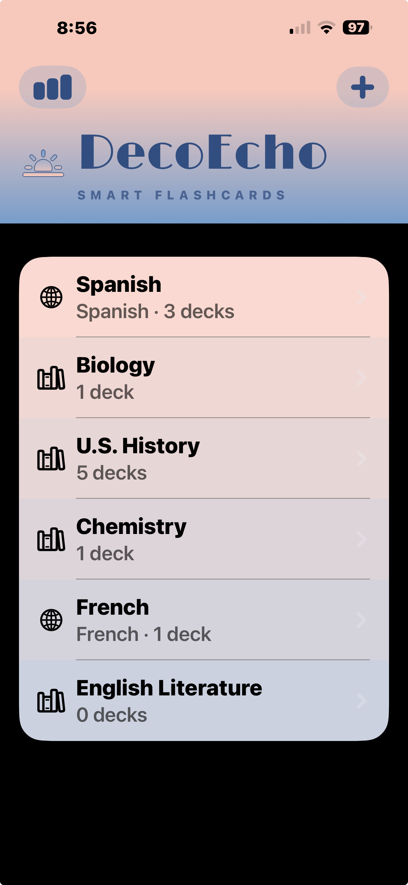
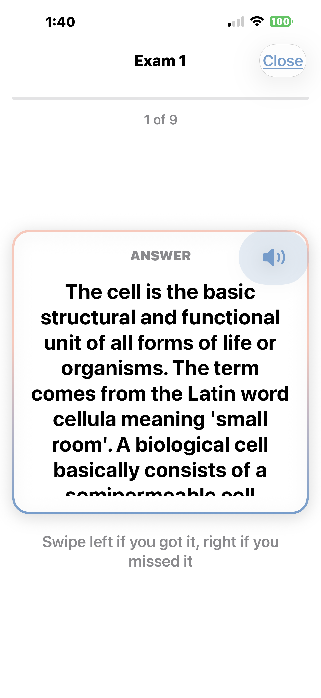
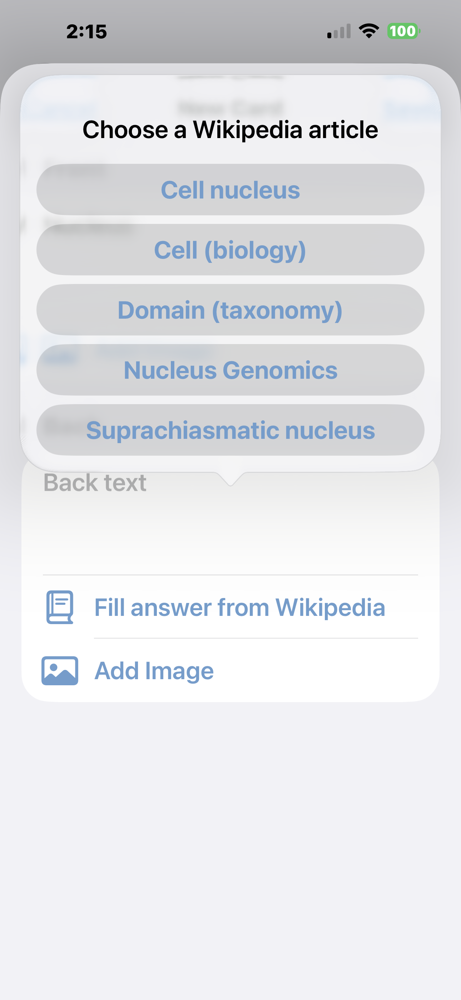
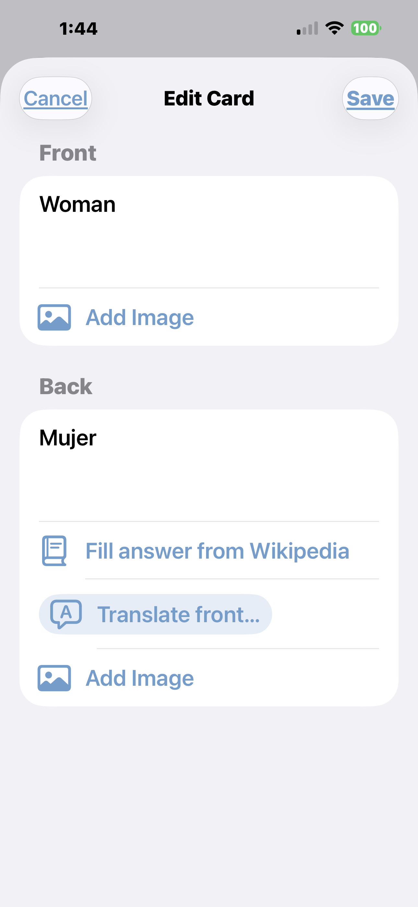
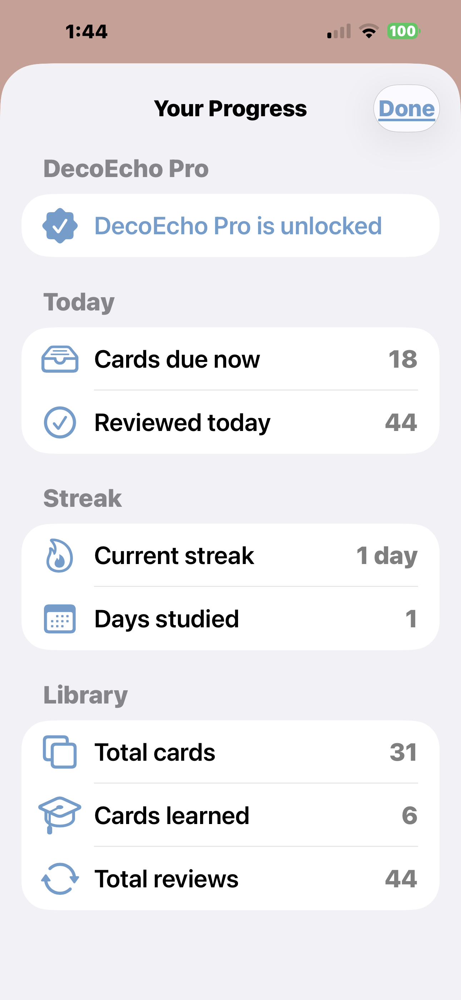

# DecoEcho — Press Kit

*Last updated: June 2, 2026*

DecoEcho is a privacy-first flashcard study app for iPhone and iPad. Below is everything you need to write about it. For anything else — interviews, additional assets, or a Pro promo code to try the paid features — email **decoecho.support@gmail.com**.

---

## Fast facts

| | |
|---|---|
| **Name** | DecoEcho |
| **Tagline** | Smart Flashcards |
| **Category** | Education / Reference |
| **Platforms** | iPhone and iPad (universal), iOS 18+ |
| **Price** | Free, with a one-time "DecoEcho Pro" unlock ($2.99) |
| **Developer** | Michael Greene (independent) |
| **Launched** | June 2026 |
| **App Store** | https://apps.apple.com/us/app/decoecho/id6773129409 |
| **Privacy policy** | https://mjguflaw.github.io/decoecho/privacy/ |
| **Contact** | decoecho.support@gmail.com |

---

## One-line pitch

A flashcard study app with spaced repetition, on-device AI, and zero data collection — built for students who want to learn, not be tracked.

## Short description

DecoEcho is a flashcard study app built for students who want to focus on learning, not fiddling with software. It combines a smart spaced-repetition engine with optional AI-powered card generation, Wikipedia autofill, instant translation across eight languages, and text-to-speech — all wrapped in a calm Miami Art Deco design. It collects no user data.

## Longer description

DecoEcho is built around a simple promise: your study data is yours alone. There are no servers, no accounts, no analytics, and no tracking. Cards, decks, and study progress live only on the user's device and in their own private iCloud — which means the App Store privacy label reads "Data Not Collected," a rarity in the education category.

The free version is a complete study tool: unlimited cards and decks, an adaptive spaced-repetition engine, swipe-to-grade and type-the-answer study modes, two-way study (recall the term from the definition or vice versa), iCloud sync across devices, and deck sharing.

DecoEcho Pro, a one-time purchase, adds the content-creation superpowers: paste your notes (or scan a photo) and on-device Apple Intelligence turns them into cards; type a topic and Wikipedia autofills a clean summary; translate vocabulary across Spanish, French, German, Italian, Mandarin Chinese, Japanese, Korean, and Portuguese; and hear any card read aloud in the correct native voice.

---

## Key features

**Free**
- Unlimited cards, decks, and subjects
- Adaptive spaced-repetition engine (SM-2 style)
- Swipe-to-grade and type-the-answer study modes
- Two-way study — practice both directions on the same cards
- iCloud sync across iPhone and iPad
- Deck sharing (send a deck file to a classmate)
- Full dark mode

**DecoEcho Pro (one-time $2.99 unlock)**
- AI card generation from pasted notes or scanned photos (on-device)
- Wikipedia autofill for card answers
- Translation across 8 languages, in both directions
- Text-to-speech with native voices

---

## What makes it different

- **Genuine privacy.** No servers, no accounts, no analytics, no ads. Nothing is collected. Everything runs on-device or in the user's own iCloud.
- **On-device AI.** Card generation and translation use Apple's on-device models — no external AI service, no data leaving the phone, and no ongoing server cost.
- **No subscription.** One small one-time purchase unlocks everything. The free tier is genuinely useful on its own.
- **Made by a first-time developer.** DecoEcho is the first app from Michael Greene, a University of Florida Law alum who had never written code before — and built the entire app as a non-programmer using AI coding tools while driving every product and design decision himself.

---

## The story

Michael Greene is a UF Law alum, not a software engineer. He'd never written a line of code. DecoEcho started as a personal frustration — flashcard apps that either looked like spreadsheets, buried features behind subscriptions, or quietly harvested user data — and became a months-long project to build the study app he actually wanted. He used AI coding tools to write the software while making every product, UX, and design decision himself. The result is a polished, privacy-first study app that costs almost nothing to operate and collects nothing from its users.

---

## Media assets

App icon and screenshots (download by right-clicking → Save):

| | | |
|---|---|---|
|  |  |  |
|  |  | |

Need higher-resolution assets, the icon in a specific size, or a Pro promo code? Email **decoecho.support@gmail.com** and we'll send them over quickly.

---

## Boilerplate

> DecoEcho is a privacy-first flashcard study app for iPhone and iPad, featuring spaced repetition, on-device AI card generation, Wikipedia autofill, translation across eight languages, and text-to-speech. The app collects no user data. It is free with a one-time $2.99 Pro unlock, and is the first app from independent developer Michael Greene.

---

[← Back to DecoEcho](../) · [Privacy Policy](../privacy/) · [Support](../support/)
